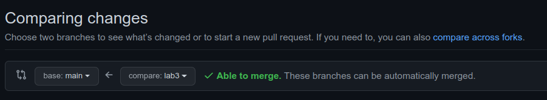

# Шаблон репозитория для лабораторных работ по курсу "Операционные системы"

## Как использовать?

### 1. Первоначальная настройка

0) Сделать аккуант на Github, если у вас его нет. Добавить SSH ключ([инструкция](https://docs.github.com/en/authentication/connecting-to-github-with-ssh/adding-a-new-ssh-key-to-your-github-account)) на Github для того, чтобы иметь возможность нормально осуществлять взаимодействие между вашим локальным репозиторием и Github.

1) Создать свой собственный репозиторий на Github, в который будем 
скалдывать лабораторные работы. Важно при создании указать, что репозиторий Public(стоит по дефолту, не трогайте). Также при создании репозитория поставьте галочку здесь:

    

2) Склонировать его себе с помощью `git clone`:

    На страничке репозитория на Github тукаем на зеленую кнопку Code, в выпавшем окошке
    выбираем SSH и копируем текст:

    
    
    Отправляемся в терминал и вводим команду
    `git clone <скопированный текст>`.

3) Cклонировать себе репозиторий-шаблон и скопировать его содержимое, а именно CMakeLists.txt, находящийся в корне репозитория(из него удалить строчку `add_subdirectory(lab1)` и папку tests вместе с CMakeLists.txt(из него удалить строчку `# LAB 1 tests` и все, что идет после нее), в папку,
в которую был склонирован ваш репозиторий

4) В README.md написать свое имя и фамилию

5) В итоге папка с вашим репозиторием должна выглядеть вот так:

    ```
    <Имя вашего репозитория>/
    |-- CMakeLists.txt
    |-- README.md
    `-- tests
        `-- CMakeLists.txt
    ```

6) Закоммитить изменения:
   
   Основной командой при работе с git является `git status`. Она позволяет понять в каком состоянии находится ваш репозиторий. Посмотрим на её вывод после добавления в наш репозиторий файлов из репозитория-шаблона:

   ```
    On branch main
    Your branch is up to date with 'origin/main'.

    Changes not staged for commit:
    (use "git add <file>..." to update what will be committed)
    (use "git restore <file>..." to discard changes in working directory)
        modified:   README.md

    Untracked files:
    (use "git add <file>..." to include in what will be committed)
        CMakeLists.txt
        tests/

    no changes added to commit (use "git add" and/or "git commit -a")

   ```

   Первая строчка говорит, что мы находимся на ветке main(до недавнего времени была master, но это кого-то там ущемляло, we live in society...) - это основная ветка репозитория, в нее вливаются изменения из всех других веток. 
   
   Как правило, в реальных проектах под каждую задачку создается ветка, в которой производятся изменения, а затем эта ветка мерджится в main/master.

   Дальше видим строчку "Changes not staged for commit:" после нее идут все файлы, которые отслеживает git и которые при этом были изменены. Также после этой git нам любезно предоставляет подсказки что можно с этими файлами сделать:

   * `git add <file>` добавит файл в число файлов, которые попадут в коммит
   * `git restore <file>` вернет файл в последнее известное git'у состояние

   В нашем конкретном случае мы внесли изменения в файл README.md, который уже отслеживался git'ом. Мы хотим добавить это изменения в коммит, для этого пишем `git add README.md`.

   Также `git status` показывает файлы, которые лежат в папке нашего репозитория, но при этом не отслеживаются git'ом. В нашем случае это то, что было перенесено из репозитория-шаблона. Это мы тоже хотим закоммитить. Пишем `git add CMakeLists.txt tests/`. 
   
   `git add` умеет работать с глобами: например, `git add *` добавит в коммит вообще все, что лежит в папке репозитория, а `git add *.c` все файлы с расширением `.c`.

    Теперь `git status` пишет нам следующее:
    ```
    On branch main
    Your branch is up to date with 'origin/main'.

    Changes to be committed:
    (use "git restore --staged <file>..." to unstage)
        new file:   CMakeLists.txt
        modified:   README.md
        new file:   tests/CMakeLists.txt

    ```

    Видим строчку "Changes to be committed:", после нее идет перечисление всех изменений, которые попадут в коммит. git подсказывает как можно убрать файл из числа тех, которые попадут в коммит(при помощи `git restore --staged <file>`).

    Теперь закоммитим изменения, пишем `git commit -m <commit_message>`. commit_message - сообщение, которое будет ассоциировано с коммитом желательно, чтобы оно было осмысленным, максимально точно описывало изменения, но при этом достаточно коротко. В нашем случае пусть это будет `git commit -m 'Add files from template repository'`.

    Желательно не пихать все изменения в один коммит, а разбивать их на несколько коммитов, которые содержат какие-то содержательные изменения, чтобы в случае, когда что-нибудь поломается иметь возможность легко откатиться на рабочую версию.

    Для того, чтобы коммиты, которые вы сделали локально, были видны на удаленном git сервере(в нашем случае на Github), нужна команда `git push`. Желательно, но не обязательно, делать `git push` после нескольких коммитов, а не после каждого.

    Еще одна супер полезная команда - `git diff`, покажет вам все изменения, которые вы внесли относительно последней версии файлов, которые есть в git'e. Ей можно передать имя файла, чтобы увидеть изменения только для него.

    Подробнее обо всех описанных командах можно прочитать непосредственно в документации git'а: https://git-scm.com/docs.

### 2. Добваление новой лабы

Предположим, что мы хотим сделать 3 лабу, посмотрим какие действия для этого нужно проделать:

1) Первоначально нужно убедиться, что мы находимся на ветке main, это можно сделать с помощью уже знакомой команды `git status`. Если `git status` скажет, что текущая ветка не main, то нужно на нее переключиться с помощью команды `git checkout main`.

2) Далее нужно убедиться, что у нас актуальная версия ветки main(та, которая есть на удаленном git сервере). Для этого нужно использовать команду `git pull`. Если наша локальная версия является актуальной, то данная команда ничего не сделает, в противном случае она подтянет изменения, чтобы локальная версия стала актуальной. 

3) Теперь можно создать новую ветку под нашу лабу. Как уже было сказано ранее, для переключения между ветками используется команда `git checkout <имя_ветки>`, но если мы хотим переключиться на новую ветку, то этой команде также надо передать ключ `-b`. В нашем случае команда для переключения на новую ветку будет выглядеть следующим образом: `git checkout -b lab3`. git напишет следующее: `Switched to a new branch 'lab3'`.

4) Каждая лаба должна лежать в папке с соответствующим названием, поэтому в данном случае нужно создать папку `lab3`. Внутри нее еще две папки - `include`, в которую мы будем складывать все заголовочные файлы, и `src`, в которой будет лежать все файлы с кодом, кроме main. main должен находится в корне папки для лабы, там же следует создать файл CMakeLists.txt, с помощью которого будет настраиваться сборка лабы. Структура папки должна быть такой:
    ```
    lab3
    |-- CMakeLists.txt
    |-- include
    `-- src

    ```

5) Теперь нужно добавить папку в головной CMake-файл, находящийся в корне репозитория. В него нужно добавить строчку `add_subdirectory(lab3)`, она должна быть выше строчки `add_subdirectory(tests)`. После этого CMake проект с нашей лабой виден из головного CMake-файла. Это позволяет загрузить в вашу IDE головной CMake-файл и затем выбирать проект(лабу), которую необходимо собрать/запустить, а не загружать проект с каждой лабой по отдельности.

6) После всех этих действий необходимо закоммитить все измененные и добавленные файл с помощью уже знакомых команд `git add` и `git commit`. После этого можно приступать к выполнению лабораторной работы.

### 3. Конфигурация сборки лабы с помощью CMake

Предположим, что в ходе выполнения лабы вы создали три файла include/lab3.h(лучше давать более осмысленное название), src/lab3.cpp, main.cpp, а в результате хотите получить исполняемый файл. Посмотрим как будет выглядеть CMake-файл в данном случае:

1) Поскольку мы хотим, чтобы наш код собирался в исполняемый файл, нам нужна команда CMake `add_executable`. Первым ее параметром будет являться имя таргета - имя исполняемого файла, который будет собран. Пусть в нашем случае это будет `lab3`. Далее в эту функцию передаются все файлы, которые используются программой. В нашем случае это все 3 файла - include/lab3.h, src/lab3.cpp, main.cpp. Полная команда, которая должная оказаться в нашем CMake-файле: `add_executable(lab3 include/lab3.h src/lab3.cpp main.cpp)`. 
2) Описанного в предыдущем пункте уже достаточно для того, чтобы собрать лабораторную, но в той структуре папки с лабораторной, которую мы установили, для того, чтобы включить файл include/lab3.h в файл src/lab3.cpp в src/lab3.cpp придется написать строчку `#include "../include/lab3.h"`. Выглядит не очень красиво. Тут нам на помощь приходит еще одна команда CMake - `target_include_directories`. Она, как и многие другие команды CMake с префиксом `target_`, позволяет настроить сборку для конкретного таргета(исполняемого файла или библиотеки). `target_include_directories` первым параметром принимает имя таргета, затем scope(с этим параметром заинтересованные могут разобраться самостоятельно - мне лень писать) - в нашем случае это будет `PRIVATE` и список директорий. Что она делает: все переданные директории она добавляет в include path(пути, по которым компилятор ищет заголовочные файл) для компилятора. Таким образом, для включения файла include/lab3.h в файл src/lab3.cpp в src/lab3.cpp теперь достаточно написать строчку `#include "lab3.h"` и компилятор успешно соберет код, несмотря на то, что lab3.h не лежит в одной папке с lab3.cpp. Полная команда выглядит так: `target_include_directories(lab3 PRIVATE include)`.

В итоге получился вот такой достаточно короткий CMake-файл:

```
add_executable(lab3 include/lab3.h src/lab3.cpp main.cpp)

target_include_directories(lab3 PRIVATE include)
```

### 3. Добавление тестов для лабы

При выполнении лабораторной работы желательно спроектировать программу так, чтобы весь функционал был вынесен в функции, определения которых располагаются в заголовочных файлах из папки include, а реализации в файлах из папки src. В таком случае main.cpp/.c будет содержать только вызовы этих функций в некоторой комбинации, которая соответствует заданию лабораторной. Такая организация программы позволит легко покрыть её тестами. Будет просто замечательно, если на каждую функцию, которую вы определили, у вас будет написан тест.

Для тестирования лабораторных работ мы будем использовать гугловский фреймворк gtest. Тесты для всех работ будут располагаться в папке tests.

Для каждой лабораторной работы будет один .cpp файл, содержащий тесты для лабы(в нашем примере с 3 лабой пусть это будет lab3_test.cpp). Этот файл будет собираться в исполняемый файл. Что нужно, чтобы сконфигурировать его сборку:

1) В файле CMakeLists.txt, который располагается в папке tests, добавить таргет с тестами для нашей лабы с помощью команды `add_executable`. Развивая пример с 3 лабораторной, команда будет иметь вид: 
    ```
    add_executable(lab3_test lab3_test.cpp ../lab3/include/lab3.h ../lab3/src/lab3.cpp)
    ```
2) Далее нам необходимо слинковать наш исполняемый файл с библиотекой gtest, чтобы иметь возможность использовать её функционал. Это делается с помощью команды `target_link_libraries`, которая имеет стандартную для всех `target_*` команд структуру и, надеюсь, уже знакомую по `target_include_directories`. Первый параметр - имя таргета, второй - scope, далее список таргетов, которые необходимо прилинковать. Мы будем прилинковывать таргет `GTest::GTest`, объявленный ранее в этом же CMakeLists.txt. Опять-таки заинтересованные могут разобраться как он определяется. Итоговая команда: `target_link_libraries(lab3_test PRIVATE GTest::GTest)`.

3) Для удобства желательно добавить уже знакомую `target_include_directories`: `target_include_directories(lab3_test PRIVATE ../lab3/include)`. Лично я когда заголовочный файл содержится в другом CMake проекте, включаю его, используя скобки-галочки, то есть `#include <lab3.h>`, а если в том же, то кавычки `#include "lab3.h"` и вам советую. Еще важно следующее: в некоторых лабораторных требуется обязательно написание программы на языке Си, но тесты при этом всегда пишутся на C++. Чтобы корректно включить заголовочный файл для Си кода в программу на C++ необходимо поместить директиву #include в блок `extern "C" {}`. Например:

    ```
    extern "C" {
        #include <c_header.h>
    }
    ```

4) Последним шагом является непосредственно описание теста с помощью команды `add_test`. Мы будем передавать ей 2 параметра: имя теста и команду как его запускать. В нашем тривиальном случае команда для запуска совпадает с именем таргета для теста(потому что исполняемый файл и команда для запуска == название файла). Полная команда: `add_test(lab3_test lab3_test)`.
5) Итого при конфигурации сборки теста для очередной лабы в CMakeLists.txt добавится блок вида:
    ```
    add_executable(lab3_test lab3_test.cpp ../lab3/include/lab3.h ../lab3/src/lab3.cpp)

    target_link_libraries(lab3_test PRIVATE GTest::GTest)
    target_include_directories(lab3_test PRIVATE ../lab3/include)

    add_test(lab3_test lab3_test)
    ```

### 4. Создание пулл реквеста

Предположим, что вы сделали лабу, написали тесты и хотите её сдать. Первый шаг сдачи лабы - создание пулл реквеста:
1) Допустим, что вы закоммитили все, что написали для лабы(очень хочется верить, что не одним коммитом все сразу). Теперь нужно сделать так, чтобы изменения на вашей локальной ветке были видны на удаленном git сервере(в нашем случае на Github). Для этого используется команда `git push`. Если это первый вызов `git push` для вашей локальной ветки, то git напишет следующее:
   ```
    fatal: The current branch lab3 has no upstream branch.
    To push the current branch and set the remote as upstream, use

        git push --set-upstream origin lab3
   ```
    git говорит, что такой ветки на удаленном сервере нет, а также пишет команду, с помощью которой её можно создать. Копируем её и исполняем. В дальнейшем будет достаточно написать только `git push`.

2) Отправляемся на страничку вашего репозитория на Github, нажимаем на вкладку "Pull requests", на ней нажимаем зеленую кнопку "Create pull request". Вот здесь "base: main", а после "compare: " ветка с вашей лабой: 
Нажимаем "Create pull request" и еще раз "Create pull request". Ссылку на пулл реквест присылаем мне в телеграм.

3) После того как я аппрувну пулл реквест на страничке пулл реквеста появится надпись: 
После этого вы нажимаете "Merge pull request", "Confirm merge" и у вас в main ветке окажется содержимое того, что было в ветке с лабой.