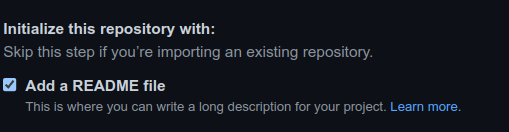
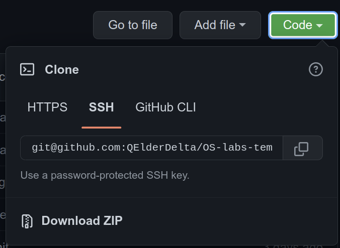

# Шаблон репозитория для лабораторных работ по курсу "Операционные системы"

## Как использовать?

### 1. Первоначальная настройка

0) Сделать аккуант на Github, если у вас его нет. Добавить SSH ключ([инструкция](https://docs.github.com/en/authentication/connecting-to-github-with-ssh/adding-a-new-ssh-key-to-your-github-account)) на Github для того, чтобы иметь возможность нормально осуществлять взаимодействие между вашим локальным репозиторием и Github.

1) Создать свой собственный репозиторий на Github, в который будем 
скалдывать лабораторные работы. Важно при создании указать, что репозиторий Public(стоит по дефолту, не трогайте). Также при создании репозитория поставьте галочку здесь:


2) Склонировать его себе с помощью `git clone`:

    На страничке репозитория на Github тукаем на зеленую кнопку Code, в выпавшем окошке
    выбираем SSH и копируем текст:
    
    Отправляемся в терминал и вводим команду
    `git clone <скопированный текст>`.

3) Cклонировать себе репозиторий-шаблон и скопировать его содержимое, а именно CMakeLists.txt, находящийся в корне репозитория(из него удалить строчку `add_subdirectory(lab1)` и папку tests вместе с CMakeLists.txt(из него удалить строчку `# LAB 1 tests` и все, что идет после нее), в папку,
в которую был склонирован ваш репозиторий

4) В README.md написать свое имя и фамилию

5) В итоге папка с вашим репозиторием должна выглядеть вот так:

    ```
    <Имя вашего репозитория>/
    |-- CMakeLists.txt
    |-- README.md
    `-- tests
        `-- CMakeLists.txt
    ```

6) Закоммитить изменения:
   
   Основной командой при работе с git является `git status`. Она позволяет понять в каком состоянии находится ваш репозиторий. Посмотрим на её вывод после добавления в наш репозиторий файлов из репозитория-шаблона:

   ```
    On branch main
    Your branch is up to date with 'origin/main'.

    Changes not staged for commit:
    (use "git add <file>..." to update what will be committed)
    (use "git restore <file>..." to discard changes in working directory)
        modified:   README.md

    Untracked files:
    (use "git add <file>..." to include in what will be committed)
        CMakeLists.txt
        tests/

    no changes added to commit (use "git add" and/or "git commit -a")

   ```

   Первая строчка говорит, что мы находимся на ветке main(до недавнего времени была master, но это кого-то там ущемляло, we live in society...) - это основная ветка репозитория, в нее вливаются изменения из всех других веток. 
   
   Как правило, в реальных проектах под каждую задачку создается ветка, в которой производятся изменения, а затем эта ветка мерджится в main/master.

   Дальше видим строчку "Changes not staged for commit:" после нее идут все файлы, которые отслеживает git и которые при этом были изменены. Также после этой git нам любезно предоставляет подсказки что можно с этими файлами сделать:

   * `git add <file>` добавит файл в число файлов, которые попадут в коммит
   * `git restore <file>` вернет файл в последнее известное git'у состояние

   В нашем конкретном случае мы внесли изменения в файл README.md, который уже отслеживался git'ом. Мы хотим добавить это изменения в коммит, для этого пишем `git add README.md`.

   Также `git status` показывает файлы, которые лежат в папке нашего репозитория, но при этом не отслеживаются git'ом. В нашем случае это то, что было перенесено из репозитория-шаблона. Это мы тоже хотим закоммитить. Пишем `git add CMakeLists.txt tests/`. 
   
   `git add` умеет работать с глобами: например, `git add *` добавит в коммит вообще все, что лежит в папке репозитория, а `git add *.c` все файлы с расширением `.c`.

    Теперь `git status` пишет нам следующее:
    ```
    On branch main
    Your branch is up to date with 'origin/main'.

    Changes to be committed:
    (use "git restore --staged <file>..." to unstage)
        new file:   CMakeLists.txt
        modified:   README.md
        new file:   tests/CMakeLists.txt

    ```

    Видим строчку "Changes to be committed:", после нее идет перечисление всех изменений, которые попадут в коммит. git подсказывает как можно убрать файл из числа тех, которые попадут в коммит(при помощи `git restore --staged <file>`).

    Теперь закоммитим изменения, пишем `git commit -m <commit_message>`. commit_message - сообщение, которое будет ассоциировано с коммитом желательно, чтобы оно было осмысленным, максимально точно описывало изменения, но при этом достаточно коротко. В нашем случае пусть это будет `git commit -m 'Add files from template repository'`.

    Желательно не пихать все изменения в один коммит, а разбивать их на несколько коммитов, которые содержат какие-то содержательные изменения, чтобы в случае, когда что-нибудь поломается иметь возможность легко откатиться на рабочую версию.

    Для того, чтобы коммиты, которые вы сделали локально, были видны на удаленном git сервере(в нашем случае на Github), нужна команда `git push`. Желательно, но не обязательно, делать `git push` после нескольких коммитов, а не после каждого.

    Еще одна супер полезная команда - `git diff`, покажет вам все изменения, которые вы внесли относительно последней версии файлов, которые есть в git'e. Ей можно передать имя файла, чтобы увидеть изменения только для него.

    Подробнее обо всех описанных командах можно прочитать непосредственно в документации git'а: https://git-scm.com/docs.

### 2. Добваление новой лабы

1) Создаем новую ветку в своем репозитории с помощью `git checkout -b <branch_name>`

2) Создаем папку под лабу с соответствующим названием(например, для 4 лабы lab4)

3) В новой папке создаем CMakeLists.txt файл, с помощью которого будем конфигурировать сборку лабы

4) Добавляем папку в CMakeLists.txt, расположенный в корне репозитория, с помощью
`add_subdirectory(<path>)`